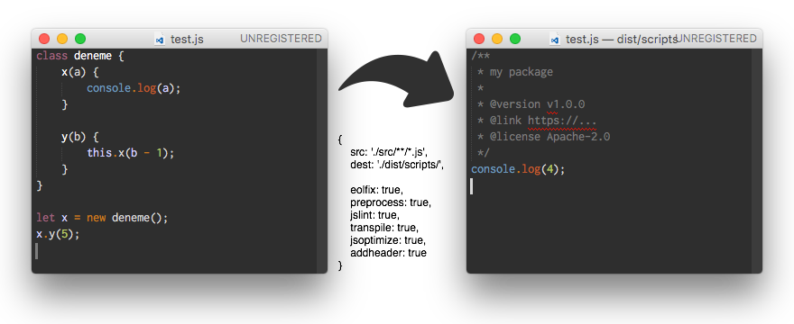

# sey

[![npm version][npm-image]][npm-url]
[![npm download][download-image]][npm-url]
[![dependencies][dep-image]][dep-url]
[![license][license-image]][license-url]

Simple JavaScript bundling tool with declarative and easy configuration. It also has incremental build support which only rebuilds changed files to pace up build and bundling processes.



Built-in modules take the responsibility of maintaining dependencies and compatibility issues.


## Why sey

As we know, there is grunt and gulp for running some tasks to make your web project production-ready. 

They also brought extra learning curve and maintenance cost for learning own configuration and packages with them.

This is where sey comes into play and offers alternative build system:

| Feature                 | sey          | Grunt        | Gulp         |
| ----------------------- |:------------:|:------------:|:------------:|
| Configuration Approach  | Descriptive  | Imperative   | Imperative   |
| Configuration Type      | API and JSON | JSON         | API          |
| Platform targeting      | node and web | Agnostic     | Agnostic     |
| Incremental builds      | ✓            |              |              |
| Built-in modules        | ✓            |              |              |
| No disk IO during tasks | ✓            |              |              |
| No maintainance cost    | ✓            |              |              |

in other words, sey...

- has ability to target node.js projects as well as web browser projects,
- has built-in tasks, which does not need extra maintenance cost due to expiration of concepts and methods. all you need is updating to keep up to date,
- has declarative configuration which only needs the input of what user expect. say goodbye to planning directives such as copy, concat, etc.
- supports partial building on changed files. it never starts over doing all tasks.
- supports both configuration and API at the same time,
- is specialized for create bundles and building projects,
- is as fast as it can be.


### Built-in Tasks

* **addheader:** adds file header to each file
* **commonjs:** enables commonjs modules in browser
* **concat:** concatenates all content of source files
* **eolfix:** replaces various EOL types with unix standard
* **jsx:** converts React JSX files into browser compatible JavaScript
* **lint:** lints source files
* **minify:** minifies source files
* **optimize:** optimizes source files if available
* **preprocess:** proprocesses source files for macro support
* **transpile:** transpiles source files to adapt standards (LESS/SASS -> CSS, ES6 -> JS, etc.)
* **typescript:** compiles Microsoft TypeScript files into JS code


### Usage

To Install:   
`npm install -g sey`

To create the seyfile in current directory:   
`sey init`

To create the seyfile (with API-type configuration) in current directory:   
`sey init --api`

To edit seyfile created:   
`vim seyfile.js` (or open **seyfile.js** with your favorite text editor)

To build:   
`sey build`

To build single bundle named 'main':   
`sey build main`

To clean working directory:   
`sey clean`


### Configuration (seyfile) Examples

Configuration Based:

```js
let config = {
    main: {
        target: 'node',
        standard: 2016,

        eslint: {
            quotes: [ 2, 'single' ]
        },

        banner: [
            '/**',
            ' * my package',
            ' */',
            ''
        ].join('\n'),

        clean: {
            before: ['./dist/*'],
            after: []
        },

        ops: [
            {
                src: ['./src/**/*.js', './src/**/*.ts', './src/**/*.jsx'],
                dest: './dist/scripts/',

                addheader: true,
                commonjs: { name: 'browserified.js', entry: './index.js' },
                eolfix: true,
                jsx: true,
                lint: true,
                optimize: true,
                preprocess: true,
                transpile: true,
                typescript: true
            },
            {
                src: ['./src/**/*.css', './src/**/*.less', './src/**/*.scss'],
                dest: './dist/styles/',

                addheader: true,
                concat: 'style.css',
                eolfix: true,
                lint: true,
                minify: true,
                optimize: true,
                preprocess: true,
                transpile: true
            },
            {
                src: './test/*.js',
                test: true
            }
        ]
    }
};

sey.run(config);
```

API Based:

```js
let config = new sey.config();

config.bundle('main')
    .setTarget('node')
    .setStandard(2016)
    .set({
        eslint: {
            quotes: [ 2, 'single' ]
        },

        banner: [
            '/**',
            ' * my package',
            ' */',
            ''
        ].join('\n'),

        clean: {
            before: ['./dist/*'],
            after: []
        }
    });

config.bundle('main')
    .src(['./src/**/*.js', './src/**/*.ts', './src/**/*.jsx'])
    .addheader()
    .commonjs({ name: 'browserified.js', entry: './index.js' })
    .eolfix()
    .jsx()
    .lint()
    .optimize()
    .preprocess()
    .transpile()
    .typescript()
    .dest('./dist/scripts/')
    .exec();

config.bundle('main')
    .src(['./src/**/*.css', './src/**/*.less', './src/**/*.scss'])
    .addheader()
    .concat('style.css')
    .eolfix()
    .lint()
    .minify()
    .optimize()
    .preprocess()
    .transpile()
    .dest('./dist/styles/')
    .exec();

config.bundle('main')
    .src('./test/*.js')
    .test()
    .exec();

sey.run(config);
```

### How sey works

sey is usually being started from command line. It simply loads its configuration named `seyfile.js` and built-in modules first.

Loaded modules may delegate any "phase". Or, they can subscribe any internal event.

Depending on command line parameters, a "preset" will be executed.

---

Sample Hierarchy:

```
- \ (presets)
  + lint
  - build (phases)
    + init
    + preprocess
    + lint
    - compile (operations)
      - jsx (tasks)
        + babeljsx
      + transpile
      + typescript
    + bundling
    + finalize
  + publish
  + test
  + server
  + deploy
```

**Preset**: A set of phases in execution order. For example `build` executes init, preprocess, lint, compile, bundling and finalize "phase"s in a sequence.

**Phase**: Each step of delivery. Consists of "operation"s.

**Operation**: The delegation point of tasks. However configuration directives tell us which operation is asked, operation must correspond to a task to be executed.

To do so, the dominant (with higher weight point) task is elected depending on modules' claims.

**Task**: The class definition of the task.


### Todo List

- Deploy Task
- Watch Task (Refresh Friendliness)
- PostCSS Tasks
- Sourcemaps
- Fancy output including line counts, lint and test results

See [GitHub Issues](https://github.com/eserozvataf/sey/issues).


### Requirements

* node.js (https://nodejs.org/)


## License

Apache 2.0, for further details, please see [LICENSE](LICENSE) file


## Contributing

See [contributors.md](contributors.md)

It is publicly open for any contribution. Bugfixes, new features and extra modules are welcome.

* To contribute to code: Fork the repo, push your changes to your fork, and submit a pull request.
* To report a bug: If something does not work, please report it using GitHub issues.
* To support: [](https://gratipay.com/eserozvataf/)


[npm-image]: https://img.shields.io/npm/v/sey.svg?style=flat-square
[npm-url]: https://www.npmjs.com/package/sey
[download-image]: https://img.shields.io/npm/dt/sey.svg?style=flat-square
[dep-image]: https://img.shields.io/david/eserozvataf/sey.svg?style=flat-square
[dep-url]: https://github.com/eserozvataf/sey
[license-image]: https://img.shields.io/npm/l/sey.svg?style=flat-square
[license-url]: https://github.com/eserozvataf/sey/blob/master/LICENSE
